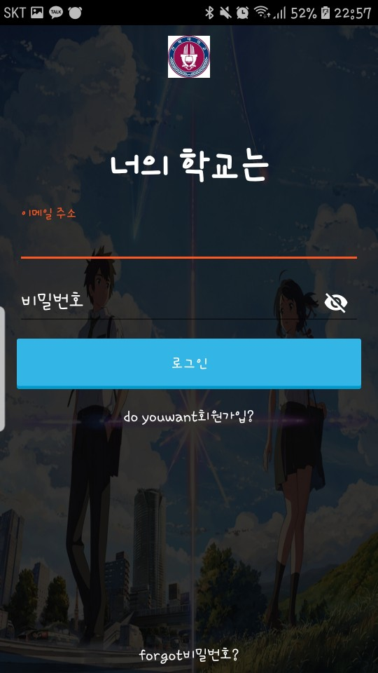
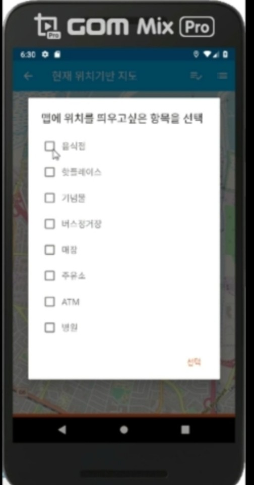
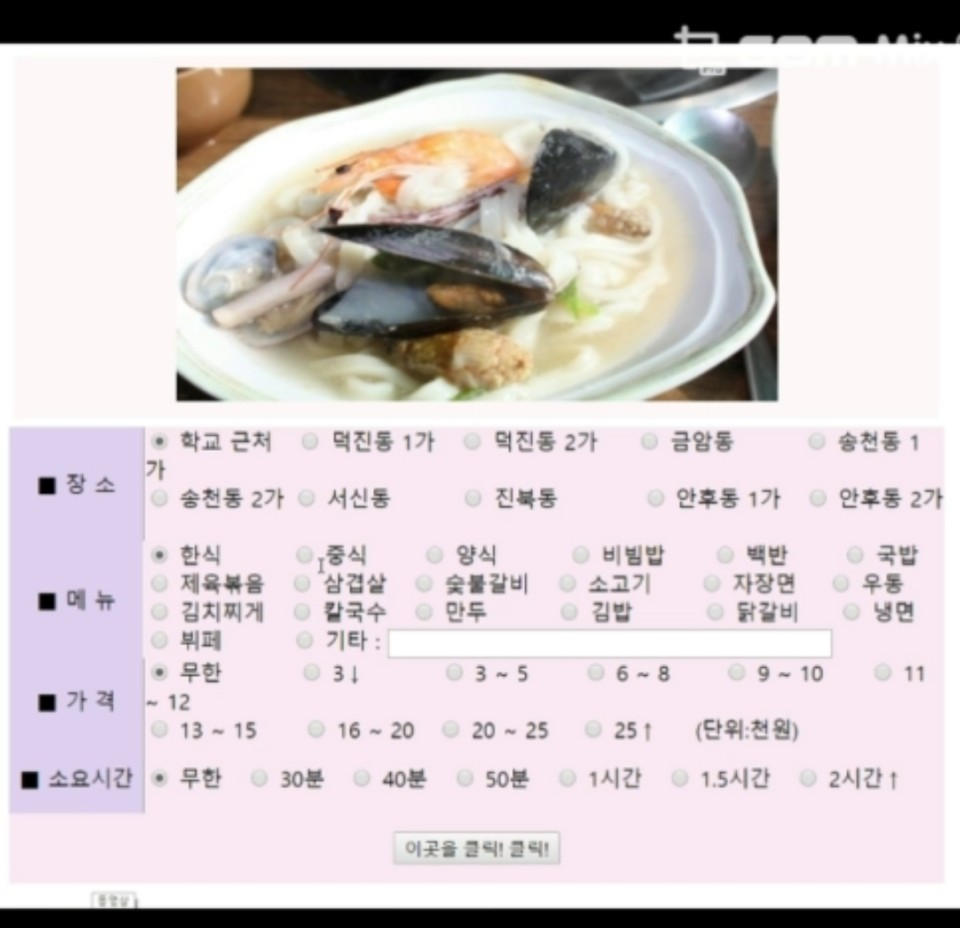
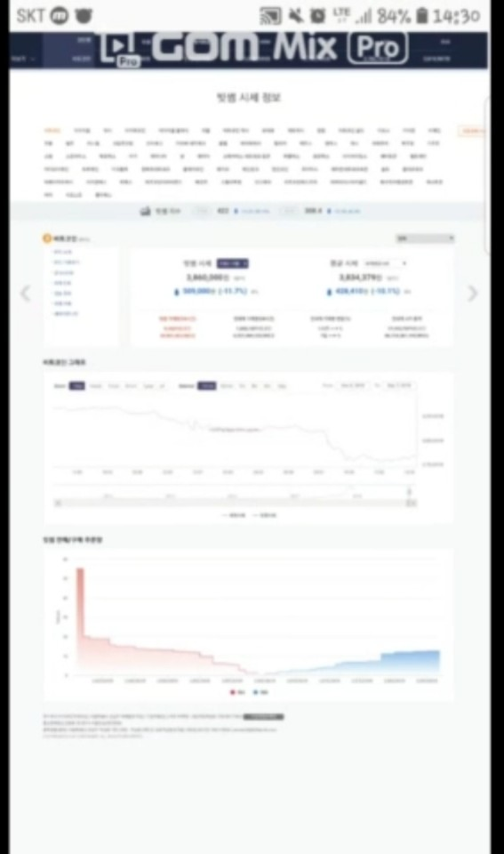

# yogiyocbnu

## 근처가게들을 gps를 기반으로한 지도 검색으로 그가게의 전화번호와 웹사이트 접근 가능    

## 지도는 포켓몬 고 라는 유명한 앱에 사용된 openstreetmap 사용 이에따라 사용자들이 지도에 기여할수있다는걸 표현 

## 전주는 아직 활성화가 되어있지않아서 맛집분석은 윤서가 만들은 웹 (다음지도)사용

## 이 기능은 빼고 이 기능 넣는게 나을까? 라는 의견이 있으시면 그 의견 수렴하여 pull request하면 merge하겠습니다. 

## 2019.05.16일 확인 결과 데이터베이스는 opensource를 이용하였는데 그 사이트가 사라져서 가입과 로그인이안되는상황.. (5월 안에 수정 예정)

 ### 김준성(saechimdaeki) :android programming             
 ### 김윤서(SophieYoonseo): web programming  
 ## Start screen from mobile phone
 

## Concept Login Screen

## The screen that tells you what is updated when you log in for the first time.

## The main function screen of this app

## Explore current location-based gps

## Additional function

## The restaurant is analyzed and presented through condition

## In addition, you can see the current market price of bitcoin.

## You can evaluate the lectures at your university.

 
 
 ## ※주제가 뭐냐는 말을 많이들었는데 팀원끼리 정한 주제는 근처의 맛집을 조건에맞춰서 랜덤선택해주는것이였지만 
 ## app관련하여 코딩을 혼자하다보니 주제가 너무 초딩, 유아틱하다고 생각하여 여러기능을 추가하였습니다. ※
